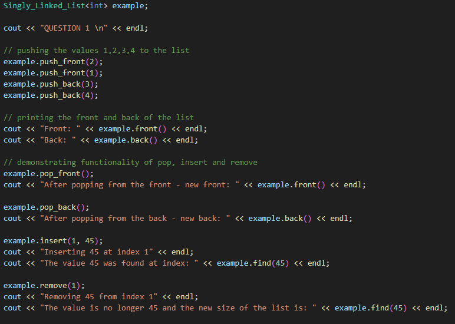
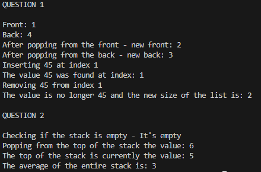

# Comp-Sci 303 - Assignment 1

There are two programs included in this assignment. The first creates a singly linked list that mimics the functionality of the standard template library linked list. The second uses a vector to create and demonstrate the functionality of a stack.

The function declarations can be found in the my-singly-linked-list.h and my-stack.h Header files.

The function definitions can be found in the my-singly-linked-list.cpp and my-stack.cpp files.

In order to run the code you can use a compiler of your choice to compile the code in the main.cpp file and run it with the example input given below.
Your build may finish with some warnings. I am still looking into the warning messages but the code runs just fine with the current example input.

## Example Input - Question 1

## Example Input - Question 2

## Example Output

